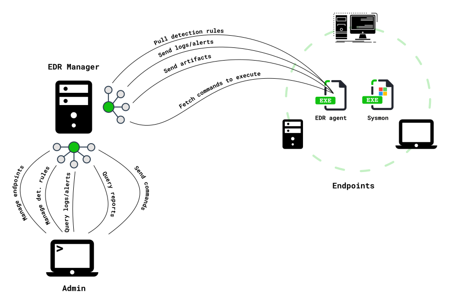

**IMPORTANT:** this README and other documentation is not updated to reflect the changes made to latest beta releases (as a lot of changes happened). All this will be updated in time when a stable version will be released (see [Roadmap until next release](#roadmap-until-next-release)). Feel free to run beta releases on your own and ask questions if you need help.

  

## What

**EDR** with artifact collection driven by detection. The detection engine is built on top of a previous project [Gene](https://github.com/0xrawsec/gene) specially designed to match Windows events against user defined rules.

 ### What do you mean by "artifact collection driven by detection" ?

 It means that an alert can directly trigger some artifact collection (file, registry, 
 process memory). This way you are sure you collected the artifacts as soon as you could 
 (near real time).

 All this work has been done on my free time in the hope it would help other people, I hope you will enjoy it. Unless I get some funding to further develop this project, I will continue doing so. I will make all I can to fix issues in time and provide updates. Feel free to open issues to improve that project and keep it alive.

## Why

* Provide an **Open Source EDR** to the community
* Make transparency on the detection rules to make analysts understand why a rule triggered
* Offer powerful detection primitives though a flexible rule engine
* Optimize Incident Response processes by drastically reducing the time between detection and artifact collection

## How

  

**NB:** the EDR agent can be ran standalone (without being connected to an **EDR manager**)

## Strengths

* Open Source
* Relies on [Sysmon](https://docs.microsoft.com/en-us/sysinternals/downloads/sysmon) for all the heavy lifting (kernel component)
* Very powerful but also customizable detection engine
* Built by an Incident Responder for all Incident Responders to make their job easier  
* Low footprint (no process injection)
* Can co-exist with **any antivirus** product (advised to run it along with **MS Defender**)
* Designed for high throughput. It can easily enrich and analyze 4M events a day per endpoint without performance impact. Good luck to achieve that with a SIEM.
* Easily integrable with other tools (Splunk, ELK, MISP ...)
* Integrated with [ATT&CK framework](https://attack.mitre.org/)

## Weaknesses

* Only works on Windows
* Detection limited to what is available in the Windows event logs channels (already a lot in there)
* No process instrumentation (it is also a strength as it depends on the point of view)
* No GUI yet (will develop one if requested by the community)
* No support for ETW
* Tell me if you notice others ...

# Installation

## Requirements

1. [Install Sysmon](https://docs.microsoft.com/en-us/sysinternals/downloads/sysmon)
2. **Configure Sysmon**
    * You can find optimized Sysmon configurations [here](https://github.com/0xrawsec/whids/tree/master/tools/sysmon)
    * Logging any **ProcessCreate** and **ProcessTerminate** is mandatory
3. Take note of the path to your Sysmon binary because you will need it later on

**NB:** event filtering can be done at 100% with Gene rules so do not bother creating a complicated Sysmon configuration.

## Pre-Installation Recommendations

In order to get the most of WHIDS you might want to improve your logging policy.

- [Enable Powershell Module Logging](https://www.fireeye.com/blog/threat-research/2016/02/greater_visibilityt.html)
- Audit Service Creation: gpedit.msc -> `Computer Configuration\Windows Settings\Security Settings\Advanced Audit Policy Configuration\System Audit Policies\System\Audit Security System Extension` -> Enable
- Enable File System Audit. Sysmon only provides FileCreate events when new files are created, so if you want/need to log other kind of accesses (Read, Write, ...) you need to enable FS Auditing.
    1. gpedit.msc -> `Computer Configuration\Windows Settings\Security Settings\Advanced Audit Policy Configuration\System Audit Policies\Object Access\Audit File System` -> Enable
    2. Right Click Any Folder -> Properties -> Security -> Advanced -> Auditing -> Add
        1. `Select a principal` (put here the name of the user/group you want the audit for). Put group **Everyone** if you want to log access from any user.
        2. `Apply this to` is used to select the scope of this audit policy starting from the folder you have selected
        3. `Basic permissions` select the kinds of accesses you want the logs to be generated for
        4. Validate
    3. File System auditing logs will appear in the `Security` log channel
- If you want an **antivirus** to run on your endpoints, keep **Microsoft Defender**, first because it is a good AV but also because it logs alerts in a [dedicated log channel](https://docs.microsoft.com/en-us/windows/security/threat-protection/windows-defender-antivirus/troubleshoot-windows-defender-antivirus#windows-defender-av-ids) `Microsoft-Windows-Windows Defender/Operational` monitored by the EDR.

## EDR Endpoint agent (Whids.exe)

This section covers the installation of the agent on the endpoint.

1. Download and extract the latest WHIDS release https://github.com/0xrawsec/whids/releases
2. Run `manage.bat` as **administrator**
3. Launch installation by selecting the appropriate option
4. Verify that files have been created at the **installation directory**
5. Edit configuration file by selecting the appropriate option in `manage.bat` or using your preferred text editor
6. Skip this if running with a connection to a manager, because rules will be updated automatically. If there is nothing in the **rules directory** the tool will be useless, so make sure there are some **gene** rules in there. Some rules are packaged with WHIDS and you will be prompted to choose if you want to install those or not. If you want the last up to date rules, you can get those [here](https://raw.githubusercontent.com/0xrawsec/gene-rules/master/compiled.gen) (take the **compiled** ones)
7. Start the **services** from appropriate option in `manage.bat` or just reboot (**preferred option** otherwise some enrichment fields will be incomplete leading to false alerts)
8. If you configured a **manager** do not forget to run it in order to receive alerts and dumps

**NB:** At installation time the **Sysmon service** will be made *dependent* of **WHIDS service** so that we are sure the EDR runs before **Sysmon** starts generating some events.

## EDR Manager

The EDR manager can be installed on several platforms, pre-built binaries are provided for Windows, Linux and Darwin.

1. Create TLS certificate if needed for HTTPS connections
2. Create a configuration file (there is a command line argument to generate a basic config) 
3. Run the binary

# Configuration Examples

Please visit [doc/configuration.md](doc/configuration.md)

# Further Documentation

* [Endpoint Manager REST API documentation](https://validator.swagger.io/?url=https://raw.githubusercontent.com/0xrawsec/whids/master/doc/admin.openapi.json)
* [How to write rules](https://rawsec.lu/doc/gene/1.6/)
* [Getting EDR detection rules](https://github.com/0xrawsec/gene-rules)
* [Overview of events enrichment](https://github.com/0xrawsec/whids/blob/master/doc/events-table.md)

# Known Issues

* Does not work properly when ran from a network share **mapped as a network drive** (this case prevent whids to identify itself and thus generate some noise). Example: if `\\vbox\test` is mounted as `Z:` drive, running `Z:\whids.exe` **won't work** while running `\\vbox\test\whids.exe` actually would.

# Roadmap until next release

  - [ ] find a new name to the project because we all agree it sucks
  - [ ] better sysmon integration (config, deployment, update)
  - [ ] endpoint configuration from manager
  - [X] tooling management (update, install), like OSQuery
  - [ ] code refactoring and optimization
  - [X] implement a performance monitor
  - [X] get rid of any on-disk configuration
  - [X] implement IOC management capabilities
  - [X] ETW support
  - [X] automatic documentation and testing of manager's API
  - [X] provide endpoint system information in manager
  - [X] implement actionable rules
  - [X] provide canary file management
  - [X] builtin commands to be executed by endpoints
  - [X] provide Incident Response reports about endpoints
  - [X] overall manager API improvement
  - [X] provide event streams so that a client can receive events in realtime
  - [X] standardize HTTP headers
  - [X] provide a python library to interact with EDR manager (https://github.com/0xrawsec/pywhids)

# Changelog

## v1.7
- New Administrative HTTP API with following features:
    - Manage endpoints (list, create, delete)
    - Get basic statistics about the manager
    - Execute commands on endpoints and get results
        * Can drop files prior to execution, to execute binaries/scripts not present on endpoint. Dropped files are deleted after command was ran.
        * Can retrieve files (post command execution), to retrieve results of the command
    - Collect files from endpoints for forensic purposes
    - Contain / Uncontain endpoints by restricting any network traffic except communication to the manager.
    - Query endpoints logs
    - Query endpoints alerts
    - Pivot on a timestamp and retrieve logs/alerts around that time pivot
    - Access endpoint report
        * Scoring (**relative to each environment**) allowing to sort endpoints and spot the ones behaving differently from the others.
        * Alerts / TTPs observed on a given time frame
    - Manage rules (list, create, update, save, delete)
- Integration with Sysmon v12 and v13
    - Integrate ClipboardData events
        * Put the content of the clipboard data inside the event to allow creating rule on the content of the clipboard
    - Integrate ProcessTampering events
        * Enrich event with a diffing score between .text section on disk and in memory
- Implemented certificate pinning on client to enhance security of the communication channel between endpoints and management server
- Log filtering capabilities, allowing one to collect contextual events. Log filtering is achieved by creating Gene filtering rules (c.f. [Gene Documentation](https://github.com/0xrawsec/gene)).
- Configuration files in TOML format for better readability
- Better protection of the installation directory

# Related Work

- Sysmon Based EDR written in PowerShell: https://github.com/ion-storm/sysmon-edr
- Comodo Open Source EDR with user and kernel components: https://github.com/ComodoSecurity/openedr
- Sysmon X: https://github.com/marcosd4h/sysmonx

# Sponsors

Github:https://github.com/tines  Website:https://www.tines.com/ Twitter:[@tines_io](https://twitter.com/tines_io)
